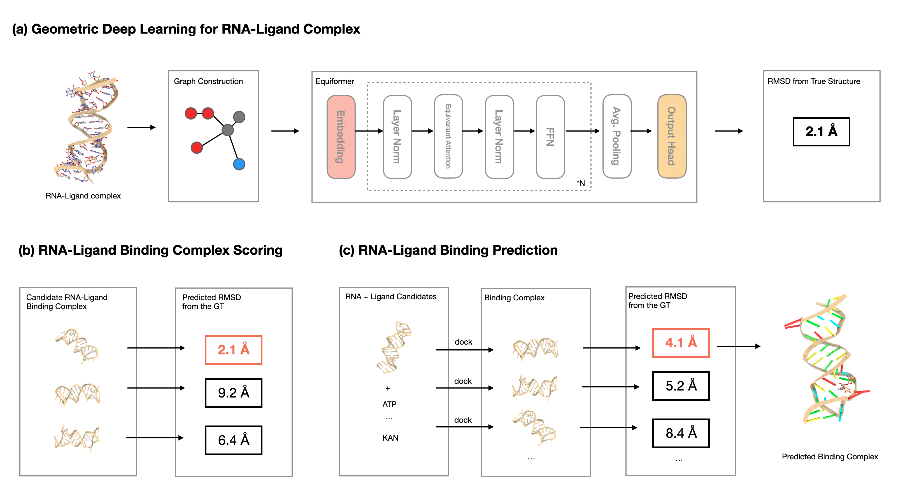

# A Framework for Predicting RNA-Ligand Interaction

This is a pipeline developed for screening RNA-ligand interaction. This pipeline combines *ab initio* RNA structure prediction and geometric deep learning for large-scale RNA-Ligand interaction screen. Our approach predicts RNA 3D structures, trains a geometric deep learning-based scoring model, generates binding complex candidates, and systematically evaluates potential ligands. Uniquely tackling RNA-Ligand interactions in three-dimensional space without experimentally determined crystal structures, our pipeline offers atomic-level assessment and holds promise for advancing RNA-small molecule interaction understanding and RNA-targeted therapeutic design.

## RNA 3D structure prediction
Check [here](structure_prediction) for details.

## Geometric deep learning based scoring model

- Data preparation
  - check out `scoring_model/processing_ligand/` for details
  - including 
    - parallel RNA-Ligand docking
    - parallel ligand parsing, and 
    - data acquisition from PDB

- Model training
  - run `scoring_model/run_wligand.sh` to train the model in default setting

- Experiments
  - check out `scoring_model/experiments/` for details
  - including:
    - method comparison 
    - discriminative selection experiment

  ## Reference

  - Equiformer backbone: Liao, Yi-Lun, and Tess Smidt. "Equiformer: Equivariant graph attention transformer for 3d atomistic graphs." arXiv preprint arXiv:2206.11990 (2022).